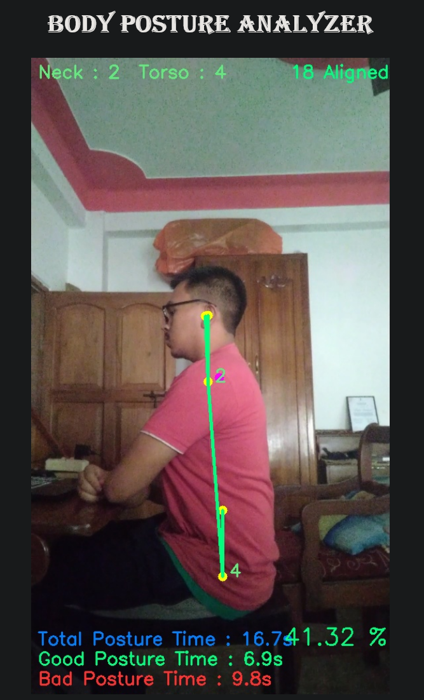
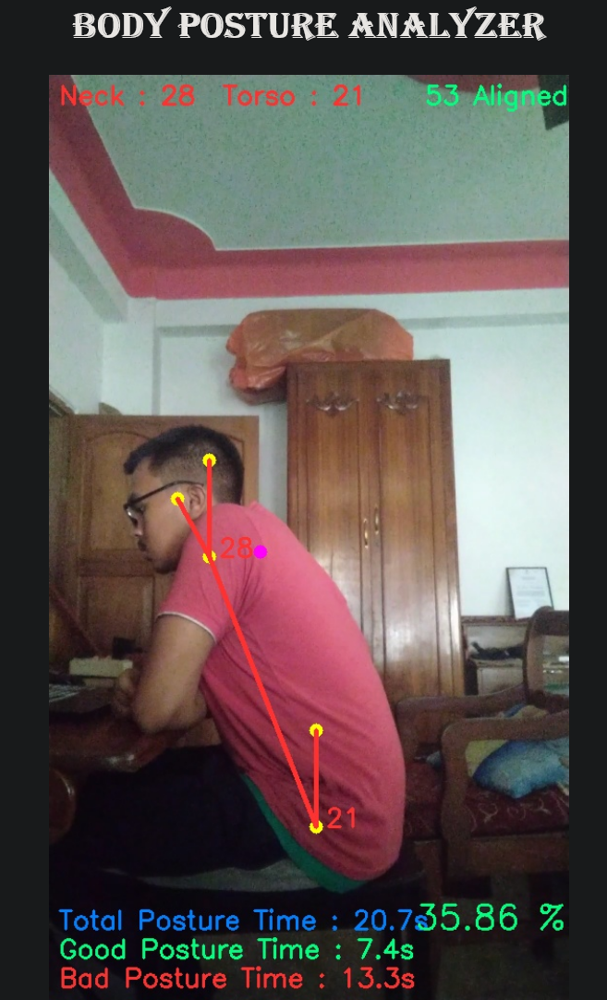

# body_posture_analysis

&nbsp;

# Body Posture Analyzer using Mediapipe and OpenCV in Python

## About Project
Our System detects a person from a perfect side view and measures the neck and torso inclination to some reference axis. By monitoring the inclination angle when the person bends below a certain threshold angle. Other features include measuring the time of a particular posture.

Our system is deployed in a Raspberry Pi and it can be used portably as the Flask server runs on WiFi and can be connected by any smartphone or

## Software Used
- Python 3.x

## Libraries Used 
- flask
- mediapipe (pip install mediapipe)
- opencv (pip install opencv-python)

## Clone this Repository 
``` git clone https://github.com/nilutpolkashyap/body_posture_analysis.git ```

## Run the Code
``` python main.py ```

## Output 
<div align="center">

</div>
<div align="center">

</div>

## Output Video🎬 - https://youtu.be/MPmzmUKnbig


## Project Created by - 
- Nilutpol Kashyap - [nilutpolkashyap](https://github.com/nilutpolkashyap)
- Priyanka Kashyap - [thepriyankakashyap](https://github.com/thepriyankakashyap)

Created as part of hackathon submission to [SF Hacks 2022](https://sf-hacks-2022.devpost.com/)

Hackathon Submission Link - [Body Posture Analyzer](https://devpost.com/software/body-posture-analyzer)
